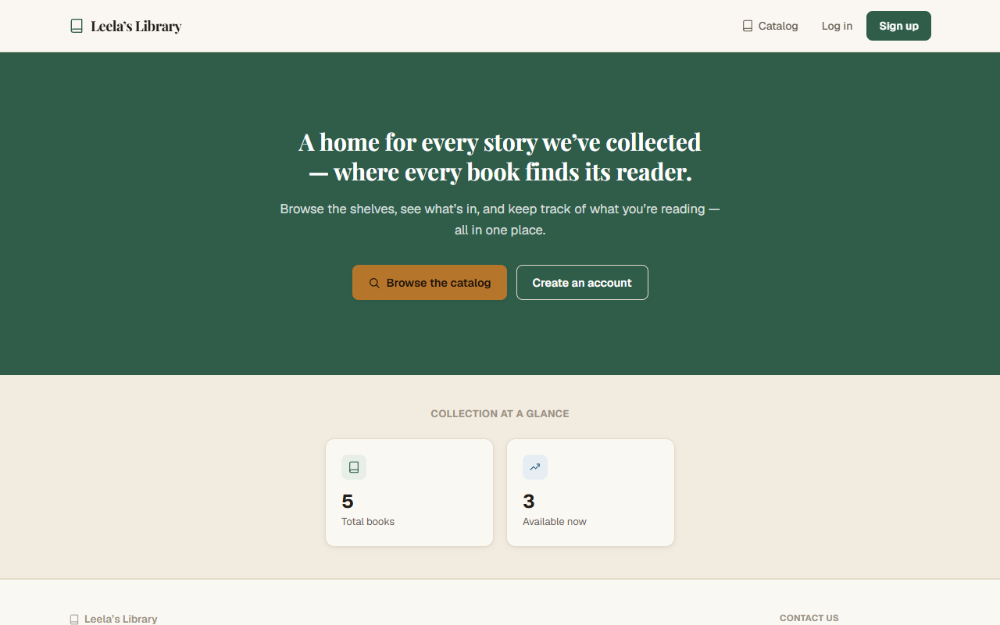
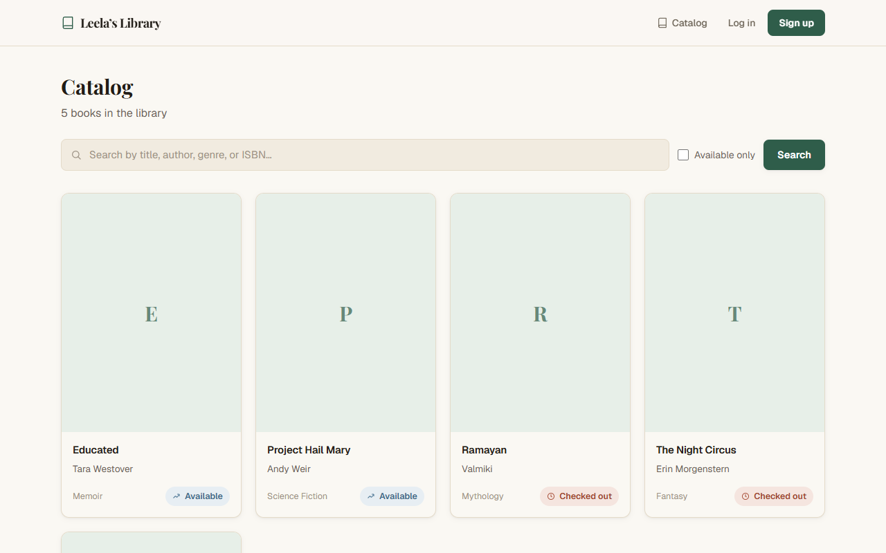
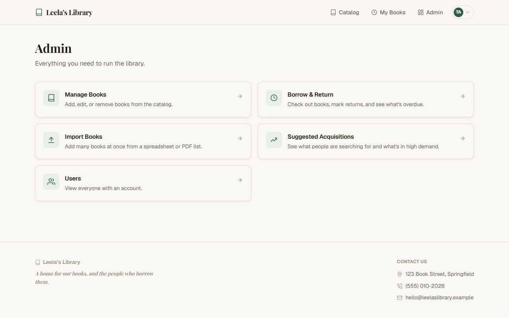
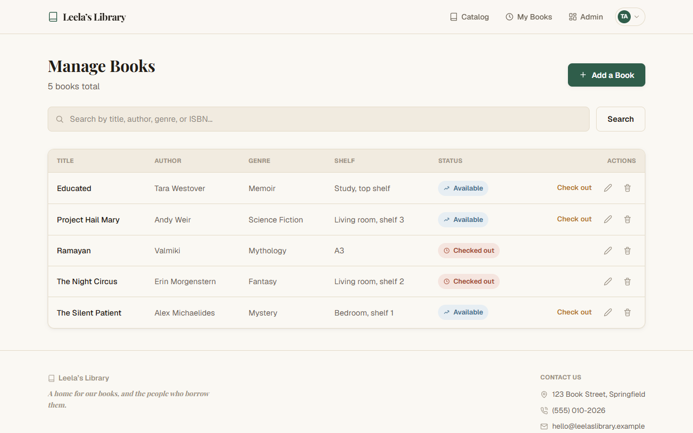
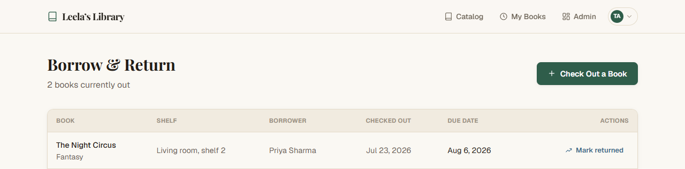
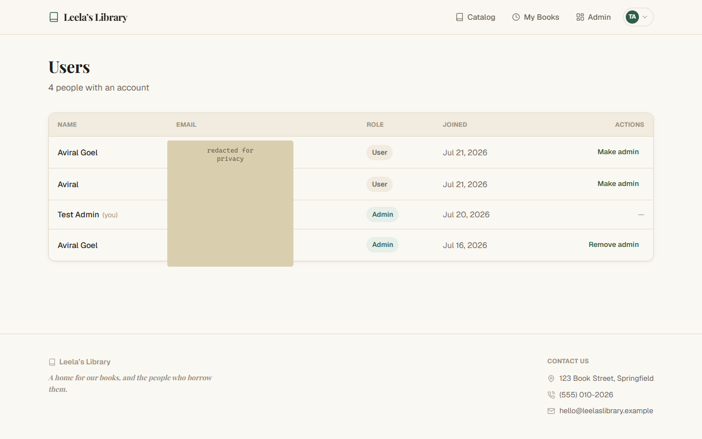
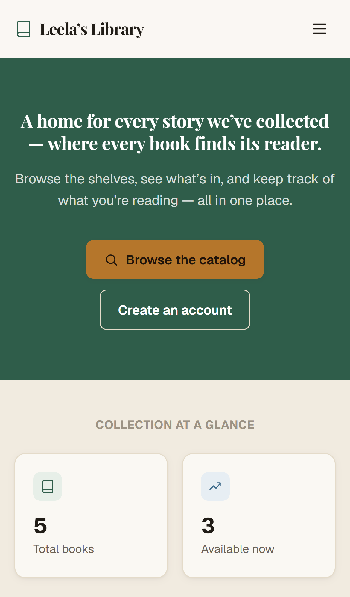
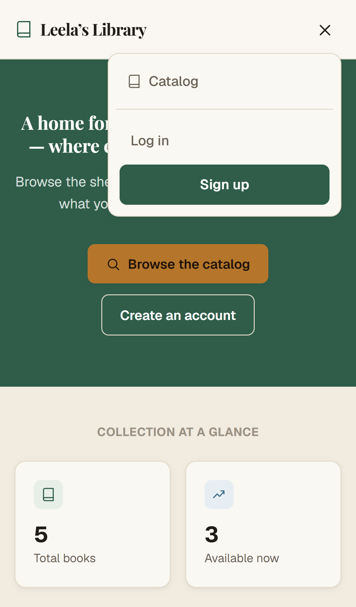
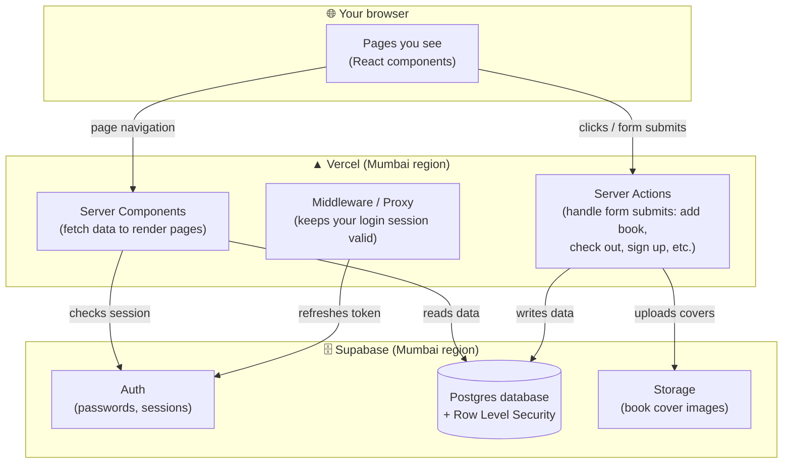

# 📚 Leela's Library

A private, family library catalog — every book you own, where it sits on the shelf, who has borrowed it, and when it's due back. Built as a real, deployed web app, not a demo.

**🔗 Live app:** https://leelas-library.vercel.app
**💻 Source code:** https://github.com/goelavi04/leelas-library



---

## Table of contents

1. [What is this project? (the simple version)](#what-is-this-project-the-simple-version)
2. [A tour, in screenshots](#a-tour-in-screenshots)
3. [Who can do what](#who-can-do-what)
4. [The tech stack — and why each piece was chosen](#the-tech-stack--and-why-each-piece-was-chosen)
5. [How it's built (architecture)](#how-its-built-architecture)
6. [The database](#the-database)
7. [The "backend" — Server Actions reference](#the-backend--server-actions-reference)
8. [Security](#security)
9. [Running it yourself](#running-it-yourself)
10. [Project structure](#project-structure)

---

## What is this project? (the simple version)

Imagine your family has a few hundred books scattered across shelves in different rooms. Somebody wants to read a specific book but doesn't know if it's at home or if a cousin borrowed it three months ago. That's the problem this app solves.

It's a website where:
- Anyone in the family can **search** the collection and see which books exist and whether they're available.
- An **admin** (a parent, say) can add new books, say exactly which shelf each one lives on, and mark a book as "checked out" when someone borrows it — with a due date, just like a real library.
- Everyone can log in and see **their own** borrowing history — what they have right now, and what they've returned in the past.

It's a real website, hosted on the internet, backed by a real database — not a spreadsheet, not a mockup.

---

## A tour, in screenshots

**The public catalog** — anyone can search it, no login required:



**The admin hub** — everything an admin can do, in one place:



**Managing books** — genre and shelf location are visible at a glance, not buried in a detail page:



**Borrow & Return** — who has what, and when it's due:



**Managing user accounts** — promote or demote admins with one click:



**On a phone** — a proper mobile menu, not a squished desktop layout:

 

---

## Who can do what

There are two kinds of accounts:

| | **Regular user** | **Admin** |
|---|---|---|
| Browse and search the catalog | ✅ | ✅ |
| See their own borrowing history | ✅ | ✅ |
| Get book recommendations based on what they've read | ✅ | ✅ |
| Add / edit / delete books | ❌ | ✅ |
| Check a book out to someone, mark it returned | ❌ | ✅ |
| Bulk-import books from a spreadsheet or PDF | ❌ | ✅ |
| Promote/demote other users to admin | ❌ | ✅ |
| See which searches turned up nothing (to know what to buy) | ❌ | ✅ |

Becoming an admin isn't something you can just tick a box for — signing up as an admin requires a secret code that only existing admins know, so random visitors can't grant themselves admin access.

---

## The tech stack — and why each piece was chosen

This section assumes **zero prior knowledge**. Each piece below solves a specific, real problem — nothing was picked just because it's trendy.

### The language: TypeScript (not plain JavaScript)

JavaScript is the language every website's interactive parts are ultimately written in. It's flexible — almost *too* flexible. You can accidentally put a phone number where a book title should go, and JavaScript won't complain until the website is actually running in front of a real user and something breaks.

**TypeScript is JavaScript with a spell-checker for logic, not just spelling.** You describe the *shape* of your data up front — "a book has a title (text), an author (text), and a price (a number)" — and TypeScript checks every single place that data is used, catching mistakes *while you're writing the code*, not after it's live. It's the difference between a teacher reviewing your homework before you hand it in versus finding out you got it wrong after the test is graded.

For a project like this — with books, loans, user roles, and forms — that safety net catches real bugs (like accidentally sending a book's ID where a user's ID was expected) before they ever reach a real user.

### The framework: Next.js

Most websites are really *two* separate programs talking to each other: a "frontend" (what you see in the browser) and a "backend" (a separate server that stores and processes data). That means writing two projects, in possibly two different languages, and carefully keeping them in sync.

**Next.js lets both live in one project**, in one language (TypeScript). It handles turning your code into the actual pages people see, optimizes images automatically, and — critically for this app — lets a page directly call a server-side function to save data, without you having to build and maintain a separate API layer by hand. It's made by the same team behind Vercel (where this app is hosted), so the two fit together with zero extra configuration.

### The database, login system, and file storage: Supabase

Every app needs somewhere to permanently store information (books, loans, accounts), a way to handle logins securely, and somewhere to store uploaded files (book cover photos). Building all three of those yourself, securely, is a significant undertaking on its own.

**Supabase provides all three as a ready-made service:**
- **A Postgres database** — a serious, industry-standard system for storing structured, related information (see below).
- **Authentication** — handles passwords securely (they're never stored as plain text) and manages login sessions.
- **Storage** — a place to upload and serve book cover images.

Think of it like renting a fully-staffed office building — power, security, mail room, all included — instead of constructing your own building from raw materials.

### The database engine: PostgreSQL ("Postgres")

Data here is naturally *relational* — a loan record only makes sense in relation to a specific book *and* a specific borrower. Postgres is built exactly for this: think of it as several very strict, linked spreadsheets (books, loans, user profiles) where the database itself enforces the connections — it will refuse to let you create a loan for a book that doesn't exist, for instance.

### Styling: Tailwind CSS

Instead of writing custom style rules from scratch for every single element (which gets messy and inconsistent fast), Tailwind provides a large set of small, pre-made "utility" classes — like a box of labeled LEGO bricks — that snap together to build a consistent look quickly. `bg-accent` always means the same green, everywhere in the app, automatically.

### Hosting: Vercel

Once the code is written, it needs to actually live somewhere on the internet, reachable by anyone. **Vercel** hosts it, automatically rebuilds the site every time new code is pushed to GitHub, and serves it from servers physically close to real users for speed (this app's server is pinned to a datacenter in Mumbai, matching where the database lives, so requests don't have to cross the globe and back).

### Image processing: sharp

When an admin uploads a book cover photo, it could be any size or format. **sharp** automatically resizes and converts it to a smaller, efficient format (WebP) on the server before it's ever stored — keeping the site fast regardless of what photo someone uploads.

### Spreadsheet/PDF parsing: xlsx and unpdf

The bulk-import feature (add many books at once from a file) needs to actually read `.csv`/`.xlsx` spreadsheet files and, best-effort, extract text from PDFs. **xlsx** (also known as SheetJS) and **unpdf** handle that parsing.

### Validation: Zod

Every form (add a book, sign up, check out a loan) has rules — a title can't be empty, an email has to look like an email. **Zod** describes those rules once, in one place, and checks every submission against them before anything touches the database.

---

## How it's built (architecture)

A traditional web app usually looks like this: a frontend talks to a backend over a fixed menu of requests (a **REST API**) — like a restaurant where the waiter carries your order to the kitchen using a printed menu card.

This app skips that menu card. A button on the page — "Add a Book" — is wired **directly** to a function that runs on the server (a **Server Action**). No separate API layer to design, version, or keep in sync. Under the hood it's still a real HTTP request, but the code reads as if the browser is just calling a regular function.



**Why this matters in practice:** the database itself — not just the app's code — decides who can see and change what, using Postgres's **Row Level Security (RLS)**. Even if there were a bug in the app code that forgot to check permissions, the database would still refuse the request. This was actually tested: a fake non-admin login was used to directly attack the database (try to read other people's data, promote itself to admin, insert books) — every attempt was blocked at the database layer, not just the app layer.

---

## The database

Five tables, all in Postgres:

| Table | What it holds |
|---|---|
| `profiles` | One row per person — name, email, and role (`user` or `admin`) |
| `books` | Title, author, genre, ISBN, shelf location, notes, cover image, availability status |
| `loans` | Who borrowed which book, when, the due date, and when (if) it came back |
| `zero_result_searches` | Search terms that turned up nothing — so admins know what people are looking for but don't have |
| `admin_code_attempts` | A log of failed admin-code guesses, used to lock out repeated attempts |

A few things enforced **by the database itself**, not just the app:
- A book can't have two active loans at once (a database-level uniqueness rule)
- A book can't be deleted while it's checked out
- A book's "available/checked out" status updates itself automatically whenever a loan is created or returned
- A non-admin cannot grant themselves admin by directly editing their own account row

---

## The "backend" — Server Actions reference

Since there's no traditional REST API, here's the equivalent: every Server Action is a function that runs only on the server, callable only from this app's own pages. Each one re-checks the caller's permissions itself — it never trusts the browser.

| Action | What it does | Who can call it |
|---|---|---|
| `signupAction` | Creates an account; if "Admin" is chosen, verifies the shared admin code (rate-limited) before granting the role | Anyone |
| `createBook` | Adds a new book, optionally with a cover image | Admin only |
| `updateBook` | Edits a book's details / replaces or removes its cover | Admin only |
| `deleteBook` | Removes a book (blocked by the database if it's currently checked out) | Admin only |
| `createLoan` | Checks a book out to a registered user or a guest, with a due date | Admin only |
| `markReturned` | Marks an active loan as returned | Admin only |
| `parseImportAction` | Reads an uploaded `.csv`/`.xlsx`/`.pdf` file and returns a preview (nothing saved yet) | Admin only |
| `confirmImportAction` | Saves the reviewed rows from the import preview as real books | Admin only |
| `setUserRole` | Promotes or demotes another account between `user` and `admin` (can't be used on your own account) | Admin only |

Everything else (searching the catalog, viewing a book, viewing your own dashboard) is a normal page load — a Server Component reads directly from Supabase and renders the result, no separate action needed.

---

## Security

A real security pass was done on this app, not just a features checklist:

- ✅ **Database-level authorization** (Row Level Security) verified by directly attacking the live API with a non-admin account — cross-user data access, self-promotion to admin, and unauthorized inserts were all blocked
- ✅ **XSS-tested** — script injection attempts in every text field render as harmless plain text, never execute
- ✅ **Rate-limited admin-code guessing** — 5 attempts, then a 15-minute lockout, tracked per IP in the database (important because the app runs on stateless serverless functions — an in-memory counter wouldn't survive between requests)
- ✅ **File upload validation** — a fake/corrupt "image" is rejected cleanly server-side, no broken data left behind
- ✅ Security headers (Content-Security-Policy, X-Frame-Options, etc.) configured for the production build

---

## Running it yourself

```bash
git clone https://github.com/goelavi04/leelas-library.git
cd leelas-library
npm install
cp .env.local.example .env.local   # fill in your own Supabase project details
npm run dev
```

You'll need your own free [Supabase](https://supabase.com) project — run the SQL files in `supabase/migrations/` (in order) in Supabase's SQL Editor to set up the database schema.

---

## Project structure

```
src/
  app/                  Pages and Server Actions, organized by route
    admin/               Everything admin-only (books, loans, users, import, suggestions)
    catalog/              Public book browsing and search
    dashboard/            A logged-in user's own borrowing history
    login/ signup/         Auth pages
  components/            Shared, reusable UI pieces (header, forms, icons, etc.)
  lib/                   Shared logic (Supabase clients, validation rules, business logic)
supabase/
  migrations/            The database schema, as plain SQL, in the order it was built
```
